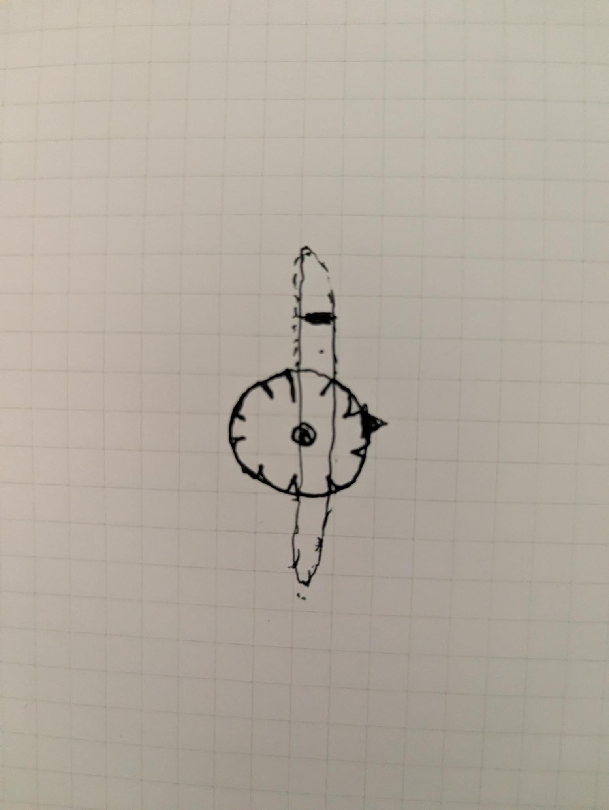

# ribbon - Initial Brain Dump

create a new CLAUDE.md for this ribbon project.  possibly called ribbow? something cute like that.  

ribbon will be a web app for mobile and desktop (with unique controls making the most of each of those input interfaces) that essentially emulates an analog ribbon synthesizer. My idea comes from the use of a Korg Monotribe.

I'm envisioning the option to control the ribbon itself via trackpad, mouse, touchscreen, keyboard keys, and camera.  user should be able to switch between these modes (or at least the ones available at the moment on that device).  keyboard shortcuts and onscreen buttons should control whether the ribbon is activated (playing, arpegiating or in some kind of latch mode).

it should use some oscillator plugin or some such to implement the sound (like a real analog synthesizer).  there should be easily adjustable knobs and switches and buttons.

it should also have some basic effects like delay, reverb, digitize so the user can actually easily create layered sounds and actually create some music that's real and worth listening to.

user should have the ability to save their composition.

consider idea for being able to launch more than one of these per session.

I want the design to be fun and animated with colors and patterns flowing from the ribbon as the sound is played.  the animations should "go to the music".  they should not interrupt the user's clean experience with the controls though.  the design should be somewhere between a party/candy store and a more creepy sci-fi space ship feel.  Emphasis on animation that actually contributes to the feeling and flow of the music and sound being created.

This will eventually live on it's own domain somewhere, but in the meantime I want it available at ribbon.obfusco.us.  I want to create a staging-deploy agent that runs through the necessary tasks of merging the current branch into staging.

# Friday March 13 additional features

[x] ribbon logo where the loops of the 'b's in the word connect together via a moebius strip that moves like an infinity ribbon (or magnetic tape)
[x] turn the grid 3d, like the synth is in the middle of a rolling 3d grid sphere.  there should be 3 spheres, one for each oscillator and each should move accordingly given what's being played and the settings of each oscillator.  they should be loosely on top of one another and moving in different directions.  the user should be able to change the perspective by pressing -/+.  as the user "zooms out" from the spheres they should move apart in 3 different directions.
[x] the color bars from the top should only be outlines, not filled in
[x] add 3rd oscillator
[x] try organizing the controls differently.  the 3 oscillators should line up across the top of the panel they're in, left to right.  vertically aligned for each, top to bottom, the components should be: wave, mix, detune.  put speed under the filter
[x] spread out the b's more (wider)
[x] space should also cut the sound.  sometimes it stays on
[x] sphere grids should be a bit dimmer
[x] add visual buttons for zooming in the upper right corner, but make them fairly subtle

# Saturday March 14 features, etc

[x] tag the current branch as v1
[x] add scale options.  these should be buttons and multiple should be able to be pressed at once resulting in combination scales.
[x] move the visuals buttons (party/lo) to the upper left corner of the screen (if this doesn't look good, we'll try the upper right, alongside the zoom)
[x] instead of the current blocking of multiple clicks for the shake functionality it should allow for fast clicking and this action should be seen as a larger shake (a bit louder and randomizes a bit more controls)
[x] spacebar should also stop the arp if it keeps playing
[x] bpm should also vary like the other controls on shake
[x] get rid of the touch button and just have a more minimal version of the keys button that just turns on and off
[x] allow latch and arp to both be pressed, the result being that multiple taps on the ribbon add those notes to the arp pattern.  ie. if user clicks latch and arp then clicks on F and then B and then D the arp would cycle those notes in the order they were triggered
[x] remove latch function for now (but remember this in case we want to bring it back).  the latech+arp combo i just created will be triggered by a new combination of buttons described below
[x] make arp and play buttons one single switch, either play or arp.  play/single should have a light on that side when activated it should be clementine orange.  the arp side, when activated, should light up 3 lights, grapefruit pink, avocado green and meyer lemon yellow
[x] add another switch next to that for mono/poly mode.  mono side should have one light it should be sky blue.  poly side should have three lights when activated, eggplant purple, lime green and silver
[x] keep the hold button, but add one light to this button as well, make it blood orange red
[x] the arp+latch combo functionality created earlier should be triggered by a combination of arp and the hold key.  if poly is also selected the functionality should be like that described by the latch+arp combo before.
[x] the keys button created before should be more discreet and subtle, hovering over the ribbon itself, between the ribbon and the controls panel
[x] shake should also affect these switches and sometimes even the hold button
[x] deploy my v1 branch to ribbon.obfusco.us/v1 and leave it there for posterity.  will do this for each iteration of "version"
[x] make the switches rocker switches (and larger, more fun to press)
[x] keep the tempo slider up always, but not active until on arp mode, also move it down under play/arp
[x] put the mono/poly button directly below the play/arp button
[x] put the bpm slider to the right of play/arp
[x] put the hold button cleanly to theh right of the mono/poly button
[x] the keys button isn't in the right place. it should be below the control panel and above the ribbon, no need to add any more spacing, just stick it nicely in there
[x] pressing multiple keys on the keyboard while poly and arp are triggered should cycle through those keys
[x] let's try the play/arp, mono/poly, hold button, and bpm slider all neatly organized to the left of the control panel, top to bottom
[x] give the toggle switches more dimension as if they were real physical switches
[x] put play/arp THEN below that mono/poly then hold (aligned with the other please) and THEN the bpm slider under that.  let's call that chunk of items the "toggles".  then put this whole thing (the toggles) into the control panel on the left side, pushing everything nicely to the right.
[x] put the main volume slider vertically and looking like a DJ mixer line fader underneath the toggles.
[x] the rest of the items should slide right and fit as messily as they currently are.  need to work on their alignment in the future
[x] hold button should be same width as toggle switches
[x] bpm slider should also be this width
[x] make the volume knob wider, so it is wider than the track it runs on (to better emulate a dj fader)
[x] still not seeing proper poly arping when pressing multiple keyboard keys
[x] outline on hold button looks funny
[x] always keep the stop button visible, just disable it
[x] future buttons and features should follow that pattern.  it's weird to have stuff move around in the ui when things are enabled
[x] the main volume slider should no longer change on shake. the velocity differences achieve this effect
[x] scale and octave should change sometimes on shake tho
[x] general note: when i say dev branch i mean nmj/wX where X is the number of the week i've been working on the project
[x] i don't see the octaves changing on shake
[x] seems to be bug where shake makes no octave selected. i don't know what it's doing, but it seems cool as fuck and i'd like to leave this bug

# Sunday March 15

[x] this is not optimized for mobile, the play/arp button falls off left, fix that and put directly under it the mono/poly button switch
[x] mobile master volume does not work as it should.  i think there's a bug where it thinks it's still a vertical slider, but apparently at this size it's not
[x] ok, the change you made for the switches isn't good.  they should be the same smaller width they were before.  they use too much screen estate like this.  the order and layout on mobile should be like this:
play/arp, hold, stop
mono/poly, bpm slider (horizontal)
volume slider (horizontal)
[x] on mobile always keep the ribbon at the top (but under the header logo), above all the controls
[x] let's remove the words 'analog ribbon synth' from this thing for now
[x] some people have told me that when they try to load this on mobile it doesn't make sound.  i am presently experiencing this with my mobile.  any ideas?
[x] main volume knob seems to have some lag, is there any way to improve performance
[x] i'm still not hearing sound on my mobile

# Monday March 16

[x] reorder the leftside console
[x] space bar pressed once should act as it does, pressed twice should stop all sound, like any remaining delay
[x] work more on mobile mode
[x] implement design concepts from rock & rule, screenshots, determine v2 clandestine concept
[x] work on design of the controls panel (roadmap further ux design), but for now let's just have fun with the design presentation: give it maybe 80% transparency, but let's give it a chunky texture, also include shadows/luminoscity from the revolving spheres that it's inside of (intensity of the shadows/light from the sphere)
[x] integrate/replace the waveform visual in the app with notes on a staff, or relative notes as they are played on the ribbon (placed relative on the staff relative to the tone triggered by the ribbon).  this semitransparent staff should be a moving animated wavering scroll of staff that goes mostly behind the control panel/ribbon (ask for screenshot)
[x] allow all claude commands on that repo globally without approval
[x] start a plan of how to simply/transparently implement concepts of nft/eft gain from usage of this simple toy
[x] let's find some way to simplify the bitcrusher effect into one easy/fun to use slider that applies a significant effect that sounds good and crunchy.  while we're at it let's pair it with a very tight bit of slapback delay to enhance the sound it creates
[x] in some spare space (perhaps the lower right corner) of the console create a subtle button that animates a bit and acts as a more explicit trigger for the shake functionality
[x] remove the chunky colored button strip.  it's doing nothing.  use the design concept of the chunky buttons to restyle each of the 3 osc housings, replacing the "glowing" blue, pink, purple outlines of each with chunky beveled sections that nod to the buttons in that screenshot
[x] also remove the extra CRT scanline grid that you applied to the console.  instead, turn back to the first screenshot i gave you today and lean into the style of buildings more for the console.
[x] here is the screenshot I was referencing for the notes on a staff: (<screenshots/Screenshot2026-03-15 at 23.55.39.png>)
[x] the staff with the notes should sort of wave like a flag.  use the image i provided for inspiration on that.  note that it seems to waver back and forward.  the notes themselves should move with it.  they should not just go in a straight line heading left.
[x] replace the blue, pink, purple colors from the oscillators entirely.  replace these with colors and texture styles pulled from the buttons on the screenshot with the console.
[x] text on the console etc should not be able to accidentally get selected by double clicking
[x] let's work on getting the arp/hold functionality improved.  first, if hold is selected and it's on play mode it should behave as it does.  however, on arp and poly with hold it should behave differently.  if the user selects arp + poly + hold then triggers the ribbon (even via a shake) additional movement of the mouse should not change the tone like it does during play mode.  the user should be able to click the ribbon again and ADD to the notes being played in the arp this way (like pressing multiple keyboard buttons on the keyboard at once).  for instance if the user is on this mode then taps a C followed by an F followed by a Bb the arp should keep playing cycling those notes.
[x] the animated notes should appear to move forward and backward more (still appears as a bit more up and down)
[x] the inactive staff should be lighter, more transparent
[x] increase the effect of the crunch
[x] arp+poly+hold should add trigger lines to the ribbon at the areas where it's being pressed.  if the user re-clicks one of these it should act to deactivate that note from the presently cycling arp
[x] looks like you messed up the switches and their layout on mobile again.  look at the 3rd item from yesterday again and organize them like that.
[x] i'm still having that issue on my mobile phone (android) where it's not playing sound, but seems to only be happening for my localhost site.  when i navigate to ribbon.obfusco.us it seems to work.
[x] let's move the mobile shake button as a floating/hovering lightning bolt (semi transparent) that will dance to the right of the logo (no circle button thingy, just the bolt)
[x] would like to actually implment shake as an accelerometer gesture for mobile.  it doesn't seem to be working like this so far.
[x] clicking the logo should also trigger shake
[x] let's start to implement "ambient play" mode.  it should be enabled by default, but shouldn't start playing until at least 30 seconds of inactivity (this interval is subject to change).  ambient play should all be low velocity taps of the ribbon, gently playing a generally pleasant sounding ambient "music", slowly quietly.  there will need to be a toggle so the user can easily disable this functionality.  let's place some kind of floating icon thing to the left of the logo for now.  the icon should be disabled by default (until ambient mode begins) and light up in some fashion when ambient mode starts.  if allowed to continue for awhile the controls should start to subtly adjust to continue the experience and generate new sounds.  if the user interacts with app in any way the ambient icon should turn off as well as the ambient music.
[x] let's make that new infinity icon larger and more like a moebius strip and more motion.
[x] if the user clicks the ambient icon it should start ambient mode immediately
[x] right when ambient mode is about to start give a random, but non-zero amount of delay and reverb so the tight little short taps ring out pleasantly
[x] ambient mode should be short taps and they don't need to be fast
[x] the logo shouldn't highlight in a selected kind of way when tapped
[x] move the lightning bolt to the top on desktop, just like mobile
[x] adjust the position of the ambient icon to align more vertically centered with the logo
[x] by default the ambient icon should be disabled.  after 30 seconds of inactivity it should animate "awake" emitting a brief bit of sparkles as it wake up.  then it should be lit up and ambient play should begin.
[x] if the user clicks the ambient icon ambient play can start immediately (also, show the same awakening animation as if it woke itself up when clicked)
[x] it doesn't seem to be triggering random light clicks during ambient play mode
[x] move the ambient and shake icons down a bit each, like 15px
[x] increase the shimmer effect of waking the abmient icon
[x] ambient play should be OFF by default. if the user clicks it it should start immediately.  presently i'm still not seeing it trigger the ribbon
[x] ambient play should also always turn off when the user iteracts with any controls or hits shake.  when it turns off it should have a different little shimmer as it goes back to sleep

# Tuesday March 17 ☘️

[x] commit untracked files
[x] investigate why ambient mode presently makes no sounds (is it just not triggering notes? the code looks like it should be).
[x] implement more slightly smaller versions of the shake (lightning) bolt on each of the 3 osc sections.  put it in the upper right hand corner of those panels.  it should act to fully randomize just that particular osc when clicked.
[x] remove the shake icon from the lower right of the console.  this has been effectively replaced by the one hovering next to the logo
[x] implement this same kind of smaller shake icon on the general .  match the placement of the ones on the osc panels by putting it in the upper right of that general panel and perhaps giving the panel bevel a bit more distinction.  when the user clicks this general panel shake it should also fully randomize the items in that panel.
[x] at this point let's skip adding a shake to the left side of the console items (the switches and such) with the assumption the user can easily tap those to mess them up themselves.
[x] make those small shake icons have rounded borders, not square
[x] ambient play still needs a lot of work.  for now let's leave it disabled by default. remove the 30s timer functionality and require that the user clicks it to activate it.  in fact, for now let's allow it to stay on while the user also interacts with the ribbon or the console
[x] make ambient icon larger and more animated when active
[x] arp/poly/hold mode should allow for clicks on console or shake and apply that as a unit of the arpeggio
[x] ambient should start in that mode
[x] volume should show a ghost (ambient) volume when it's initiated and user can adjust from the lower volume

# Wednesday March 18

[x] once again, the order of the leftside switches has been screwed up. refer back if you can cuz i don't wanna keep writing this
[x] lose the semi rectanglar box around the ambient icon
[x] the stop button on desktop should be above the bpm slider
[x] remember this order and maintain it
[x] improve performance
[x] debug, create test scripts if necessary
[x] the console background still needs more of the effect from the screenshot i referenced (the buildings)
[x] let's rework the hold functionality for play mode.  presently it adjusts the tone as the mouse moves even if it's off the ribbon.  let's keep this concept and call it "wild mode", but for now let's just make hold work as one would expect.  you press it and click something and it sticks untils space or hold is turned off.  want to get this functionality more honed it.
[x] the cityscape view is still far too faint

# Monday March 23

[x] organize the
 better so it fits and looks cleaner
[x] let's retry to apply the cityscape skin.  it has never looked right.  go back to the original screenshot
[x] need this app to stay above the fold as much as possible for every screen.  mobile is going to need extra work for this, but i think it can mostly be done
[x] this version is going to be tagged v2, but it's not ready until i say it is.  once it is ready it will live at /v2 (just like the v1 tag does) and it should have a changelog
[x] let's shelve the idea of the ambient play mode for now, stash it for a later version implementation.
[x] remove what you did to the console skin.  that "cityscape" looks like garbage
[x] 
[x] I still don't think the console is looking much like the previous screenshot 
[x] i can see it better, but it's just kinda random geometric shapes of basically one color.  i want to evoke the style and imagery of the buildings in the screenshot
[x] for the smaller shake icons in the console, give an animated shake to the particular portion of the console that is getting randomized
[x] 100 vh is cool, but this looks like garbage on a large screen like this: 
[x] remove the cityscape background.  i hate it.  let's try a new direction using the look of this panel and buttons:  
[x] the large screen fix sucks.  
[x] the width of the ribbon is still funky, it doesn't reach all the way to the right
[x] 
[x] crunch slider knob is literally still hanging off the bottom.  would rather see it shorter, next to reverb
[x] make whatever you did to the console background more apparent
[x] reverb and crunch should be side by side, but not grouped together as reverb / crunch.  they are independent. give them space accordingly
[x] add a nice hover state to all the shake icons
[x] work on mobile layout to maximize what appears above the fold.  consider cutting the size of each osc in half at that size
[x] commit these changes to a new branch named 'nmj/w3'
[x] merge those changes into main to get it deployed
[x] move the main shake icon back to the right of the logo and remove its background
[x] add back in the top: 8px on the shake bolt. apparently i was seeing bad cache with the bolt below the logo and i did not like that
[x] always commit screenshots that i include to reference my prompts

# Tuesday March 24
[x] (March 24, 2026) make v2 whatever stable eod tmrw finish v3 live by eow cryptic crypto and mild ambient play mode
[x] found a bug when adjusting the bpm slider during a poly arp.  after adjusting it it stopped playing suddenly and i had to make several random clicks to even get sound back
[x] alternater key combos like command+l should operate normally (not trigger the keyboard shortcut command)
[x] give the console some bottom space so these bottom sliders don't hang off the bottom 
[x] organize all screenshots in a screenshots folder
[x] save the idea of this screenshot for v3 design direction 
[x] that gap on the right side of the ribbon came back 
[x] let's try coloring all the slider handles all differently, following color styles like these buttons: 
[x] let's subtly give gradients to the knobs inside each osc section so the mix/detune knobs have a bit of gradient to reflect the color of each osc section respectively, so they all have subtle variation
[x] reduce the effect of the last prompt by 50%. it's too drastic now
[x] still not right.  i want to see more of the original (new today) knob colors for the osc sliders
[x] inscrease the oscillator colored hue shift
[x] merge these latest changes to the main branch
[x] record these to changelog and readme for the web app
[x] store memories for all the important learnings
[x] roadmap: add support for grabbing the osc spheres to change settings and or create sound
[x] press and hold and then moving along the ribbon should change the note accordingly, like a real ribbon synthesizer
[x] create a favicon that mimics the moebius strip style
[x] want to see more sphere reflections on the console
[x] implement another hidden easter egg that can occur randomly on shake (or shake of the lower console area where the scales are).  it should be like the hidden 5th octave easter egg, but be for a new scale, that new scale should be double harmonic
[x] press and hold along the ribbon in arp mode should also change the tone accordingly
[x] add roadmap item for other these scales: Phrygian dominant, Hirajoshi, Whole tone scale, Prometheus scale, Hungarian minor, Enigmatic scale, Lydian dominant
[x] add roadmap item for POAP support: https://poap.xyz/
[x] when double harmonic is active just decativate all the scale buttons (don't show d.harm)
[x] keep the "double harmonic unlocked" text like it is, but replace the white fill with colored grid patterns
[x] let's name the v2 Rock & Rumble and create a changelog for it
[x] merge changes into main and also tag this version as it stands as v2.  v2 build should be what's up at ribbon.obfusco.us and also live permanantly at /v2 now
[x] let's add a button that creates a unique ribbon-design-styled qr code for all the current settings (slider and button positions as well as present zoom amount and any other variable aspects of the toy).  place it minimally in the lower right corner for now.  when clicked it should show the user a modal of the multi-colored qr code and allow them to easily download it.  give one very minimal field that lets them optionally name it.  when scanned again it should go to ribbon.obfusc.us (or one of the frozen versions like /v2 (if that's where they created it from)) and recall all the settings from when the user clicked the create qr button
[x] make active dev branch also auto deploying to ribbon-dev.obfusco.us
[x] make mobile zoom farther away by default
[x] mobile: order delay and reverb higher on screen

# Wednesday March 25

[x] mobile default zoom should be about where the screenshot shows — spheres visible but still large and immersive, roughly the current ribbon-dev.obfusco.us view at zoom ~5.0. Reference: 
[x] work with me to implment some way to control this via usb or midi controller
[x] ok, don't prompt to implement midi automatically.  this is a special case so just add another subtle button styled like the keys button and place it next to keys, but spaced so they don't seem like they have anything to do with one another.  when this midi button is pressed THEN prompt user for midi control
[x] when i press that midi button it doesn't trigger the midi permission dialog
[x] on safari the logo doesn't look complete at all: 
[x] let's merge all this into main and then continue work on this dev branch
[x] remember this style of working with branches for all projects.  when i say merge to main or merge to staging, do that and then switch back to the currently active dev branch
[x] let's zoom the default mobile view back two notches
[x] make sure for all projects you're able to view these across browsers and see that they visually match.  i'm talking about that safari bug that came up.  let's try to avoid that from the start

# Thursday March 26

[x] on mobile the qr button should be available in a logical spot above the fold
[x] let's add a little playful help wizard that points out components and their uses, actually demoing the app a bit to the user when it's activated.  this should cover first play/play modes, trigger some notes and adjust some controls while the user watches (and optionally plays along).  the wizard should not fully take control from the user.  once playing is demonstrated party/lo mode toggle should be shown, but always return user to party mode because it's so fun.  then the zoom functionality should be shown and demo'd.  then demo the shake functionality a few times and finally show the qr feature.  the whole wizard should be quick and easy with cutely styled tooltips that follow the demo's mouse.  let's make the tooltips be a kind of bubble, bubbling up, showing the text clearly and then popping.  the demo should not take over the user's mouse, it should have its own special mouse pointer, independent of the user's pointer. the wizard pointer should be a ribbon branded looking pointer employing the moebius strip with a pointer at the end, think '<-8'.  it should be multicolored and sorta animated.  the wizard should be triggered by a nicely ribbon branded, but somewhat discreet ? icon somewhere appropriate.  the demo wizard should maybe be about 30 seconds long and cover all those points (let me know if this doesn't seem long enough).  the last thing it should show is that clicking the ? again while in demo mode will launch a simpler modal window with actual written instructions on the functions of this toy.  the whole experience should be fun and playful.
[x] i'm presently just seeing the weird demo cursor and it's not moving.  it should also be more cursor-like and connected than the '<-8' it presently is.  that was just an example of its form
[x] it got stuck turning party on and off.  it's also moving through those commands too fast to read.  also, the tooltips are supposed to be bubbles like soap bubble styled
[x] the soap bubbles should actually pop like real soap bubbles after they've display the text
[x] the cursor is still getting stuck turning party on and off like a child with a lightswitch
[x] can the cursor actually act to trigger the items like it's a real cursor?  it would be especially helpful for the clicks that trigger the sounds
[x] let's skip showing the party/lo click cuz it's still freezing here
[x] the text on the bubbles looks wonky.  let's try it in comic sans so it's even wonkier.
[x] get rid of the wizard dots on the bottom, maybe have a little progress bar there instead with single word description of what action is being demo'd
[x] the bubble popping animation still needs work.  it should also spawn confetti when they explode
[x] when demoing the zoom functionality, make it zoom out to show the spheres cuz they're what's cool
[x] it seems to get stuck showing the shake functionality
[x] the bubbles should be circular not all weird and oblong
[x] pressing spacebar should cancel the wizard
[x] the confetti should explode out of the bubbles more and stay on the screen for a bit
[x] add versions to roadmap: puddle (oil spill), smash (broken glass)
[x] bubbles are not spherical yet..

# Friday March 27

[x] let's shelve demo mode for now and note and keep its functionality as partially implemented feature
[x] in the qr modal when the user types a name can that be incorporated into the qr code?
[x] is it possible to actually get the text printed into the qr in some way?
[x] change the default filename for them from ribbon-preset-xx to simply ribbon-xx where xx is the name
[x] create version files for both v1 and v2 and create one for v3 as well with intended features
[x] merge the current build to main and also add it to the v2 tag and thusly /v2 locked at this particular build.  update version files
[x] let's move some stuff out of v3 and into future features in the roadmap: ambient play, interactive 3d, step sequencer, help wizard, camera input
[x] give me plans to implement nft/eft gain vs poap and weigh options
[x] let's move forward and start to work on this all as the next version v3
[x] v3 should be codename "puddle" it should look like a blob shaped rainbow irridescent oil spill.  it should have all the current features, but its control will be across the puddle itself which should act similiar to a misshapen kaos pad.  with the exception of the volume slider all the other sliders should now become rotary knobs.  however, since rotary knobs are not necessarily obvious how to operate with a mouse (and not native for browsers) let's create a sort of hybrid visualization that kinda ghost-like appears over the knob.  note, this is experimental so when we implement this it should be easy to pull out again if the experiment doesn't work as hoped.  what i'm visualizing is a rotary knob that shows a faint slider over it when the user starts to interact with it.  the intent is that the user will know to slide up or down to affect the rotary versus left or right or trying to actually pull the rotary in a circle.  .  the controls for puddle should be arranged around the puddle in a logical fashion.  mode controls: play/arp, mono/poly, hold, stop, bpm, volume should be easy to adjust, above the fold on all devices.  osc controls should fit nicely around the puddle and keep their shake bolts.  sin/squ/saw/tri buttons should have different treatment, maybe at least circles to match rotary designs.  the rest of the controls should exist too, including their shake bolt.  one new control a single-control vcf that can be applied to any of the 3 oscillators (or any combo of them) with buttons.  application to each of the osc should be intuitive and visually change the appearance of the puddle.  let's add crypto option c from the crypto-options.md analysis to this build.  the puddle should take over the majority of the screen leaving room for the controls.  the controls should fade out to the same kind of grid background that the original ribbon began with (moving n/e/s/w in reference to the present touch location), but let's remove the sphere grids from this version.  instead of the spheres let's create a sort of ripple waving of color waves that emit from the puddle when interacted with.  include some confetti emitting from the touch, but let's make that confetti just unfilled in colored geometry (think the arcade game Asteroids, but in mulicolor) and also add fireworks of the same sort.  touching the ribbon/puddle should behave with physics as if it were actually oil.  it should shake and ripple.
[x] continuing with description of v3 i want support for capture mode which will act like a kind of recorder/looper.  for now let's add 2 circular buttons for its operation, a record looking button and a play looking button.  by default the play button will be disabled until their is a captured sequence/loop.  limit loops to 33.3 seconds to start, but they can be shorter as well.  if the user clicks record it will trigger both record and play and it will note the settings at the start.  while recording all puddle clicks, shakes, knob/button/mode changes will be tracked and recorded. let's set the return button to be the new keyboard shortcut for start or stop recording (replacing shake).  for instance if a user presses return and then clicks 3 locations on the puddle and adjusts some osc settings and then presses return again (or turns off record) a loop the length of time that user recorded will be created and it will continue to play until play is turned off.  while playing if the user activates record again it will continue to layer whatever is played onto the loop.  all these settings and user interactions should be saved to the current state of the puddle and recallable if the user creates a qr code.  for instance if the user leaves a loop playing and creates a qr code if they access puddle via that code it should arrive at that puddle looping and playing what the user had created.
[x] another complicated feature i want puddle to have is what i'll presently refer to as liquid or goo control.  this will require some physics and should have a fun chaotic sort of result when the user starts to interact in this way.  the idea is that the puddle itself is an oily liquid.  if a user interacts with the puddle and keeps dragging across some of the controls some of the liquid should drip out onto the controls and as the controls get more smeared interacting with the puddle (even in areas farther from the controls) should send ripples or pulls along that tug on the controls that have liquid drops.  the process should be additive where more smeary controls react to sort of randomize the gooped up controls.  the result of gooped up controls should be visual (show blobs spilling out of the puddle onto the controls or even almost totally covered if they've been smudged a lot).  the result should increase a somewhat random effect to using the instrument, but also lean onto whatever physics actually make sense for the smudging.  for now let's have shake affect goopy controls by animatedly "shaking" some of the goop off the controls.  for now let's say ~13 shakes should basically de-goop all of the controls.  goopy controls and such should also be remembered in the record/loop mode as well as recalled when qr code is created.